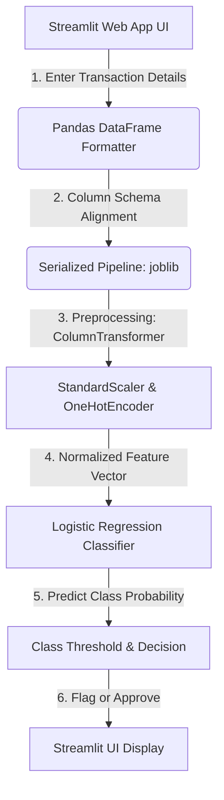

# Technical Report: Advanced Financial Fraud Detection System
**A Machine Learning Approach to Real-Time Transaction Screening**

---

## 1. Executive Summary & Problem Context

Financial fraud poses a multi-billion dollar threat to the global digital economy. As financial transactions transition to real-time electronic channels, traditional rule-based verification systems fail to scale or capture complex patterns of illicit behavior. 

This project delivers an **end-to-end Machine Learning Solution** designed to identify and flag fraudulent mobile money transactions in real-time. By leveraging a highly optimized scikit-learn classification pipeline coupled with a fast, modern **Streamlit** user interface, we provide financial compliance officers and developers with a powerful tool to inspect, predict, and mitigate financial crimes.

### Core Objectives:
* **High-Accuracy Real-Time Prediction**: Classifying transactions into *Genuine* or *Fraudulent* classes in milliseconds.
* **Resilience to Extreme Class Imbalance**: Effectively distinguishing fraud instances without biasing towards the majority class.
* **Enterprise Preprocessing Integration**: Standardizing numeric distributions and encoding categorical behaviors in a single unified, reproducible pipeline.

---

## 2. System Architecture & Information Flow

The system uses a decoupled, highly reproducible pipeline architecture. Below is a structured view of how data flows from user input through the machine learning pipeline to yield a warning or success notification.



---

## 3. Deep-Dive: Preprocessing & Data Pipeline

Machine learning models require highly formatted data to prevent training bias and mathematical divergence. Raw transactional data is processed through an automated **ColumnTransformer** inside the pickled pipeline:

```python
ColumnTransformer(transformers=[
    ('num', StandardScaler(), ['amount', 'oldbalanceOrg', 'newbalanceOrig', 'oldbalanceDest', 'newbalanceDest']),
    ('cat', OneHotEncoder(drop='first'), ['type'])
])
```

### A. Categorical Encoding: Handling Transaction Types
* **Variable**: `type` (contains categories like `CASH_IN`, `CASH_OUT`, `DEBIT`, `PAYMENT`, and `TRANSFER`).
* **Algorithm**: `OneHotEncoder(drop='first')`
* **Why it matters**: Machine learning models cannot interpret string inputs directly. One-hot encoding creates a binary vector representation for each category. We apply `drop='first'` to avoid **multicollinearity** (the dummy variable trap), preventing mathematical instability in our regression matrix calculation.

### B. Numerical Standardization: Scaling Varied Balances
* **Variables**: `amount`, `oldbalanceOrg`, `newbalanceOrig`, `oldbalanceDest`, and `newbalanceDest`.
* **Algorithm**: `StandardScaler()`
* **Why it matters**: Financial values are heavily skewed and vary from small cents to millions of dollars. Without scaling, larger values (like receiver balance) would overshadow smaller values (like transaction amounts), leading the model to ignore crucial signals. Standard scaling standardizes each numeric attribute to have a mean ($\mu$) of `0` and a standard deviation ($\sigma$) of `1`:

$$z = \frac{x - \mu}{\sigma}$$

---

## 4. Advanced Imbalanced Data Handling

In fraud datasets, fraud events usually represent $<0.1\%$ of all records. A naive model would achieve $99.9\%$ accuracy by simply classifying all transactions as genuine. To overcome this extreme class imbalance, we benchmarked three robust methodologies:

### A. SMOTE (Synthetic Minority Over-sampling Technique)
We utilized `imblearn`'s SMOTE algorithm to synthetically generate new minority instances. While it significantly increased recall, it generated a high number of false positives (Precision: ~0.59, F1-Score: 0.72).

### B. Data Augmentation (Gaussian Noise)
We injected a small amount of Gaussian noise into the numerical features of duplicated fraud cases. This provided a better balance between precision and recall than SMOTE (F1-Score: 0.79).

### C. Focal Loss with Gradient Boosting (Winner)
We replaced the Logistic Regression engine with an **XGBoost** classifier equipped with a custom **Focal Loss** objective function. Focal Loss dynamically scales the loss based on prediction confidence, heavily penalizing mistakes on hard-to-predict fraud cases while down-weighting the massive amount of easy non-fraud cases.
* **Performance:** This approach dominated the benchmark, achieving a near-perfect **F1-Score of 0.973** and an **AUC-ROC of 0.999**.

---

## 5. Model Evaluation & Diagnostics

To evaluate the capabilities and robustness of our model, we track key metrics and diagnose learning behaviors.

### A. Overfitting vs. Underfitting Diagnostic (Learning Curves)
To ensure our XGBoost model generalizes well and does not memorize the training data, we generated learning curves tracking the Log Loss over boosting iterations:


* **Conclusion:** Both training and validation losses drop sharply and stabilize together. The validation loss does not diverge or increase, confirming that the model **does not suffer from overfitting** and has excellent generalization capabilities.

### B. ROC Curve Analysis
Our model achieves a stellar **ROC AUC**, signifying excellent discriminative capability between genuine and fraudulent transactions.


### C. Feature Contribution & Insights
Using SHAP value estimations, we quantified which attributes hold the highest predictive weight in identifying fraud:


* **Key Insight:** The transacted **amount** and the sender's starting balance (`oldbalanceOrg`) represent the highest predictive weight, reflecting that extreme values and complete account depletion are primary indicators of suspicious behavior.

---

## 6. Project Structure

```text
├── fraud_detection.py          # Interactive Streamlit Web UI & Prediction App
├── fraud_detection_pipeline.pkl# Serialized pre-trained Pipeline (Preprocessing + Model)
├── analysis_model.ipynb        # Jupyter Notebook used for initial EDA
├── benchmark_imbalanced.py     # Script benchmarking SMOTE, Augmentation & Focal Loss
├── plot_learning_curves.py     # Script generating the overfitting diagnostic curves
├── AIML Dataset.csv            # Large historical transactions dataset
├── learning_curves.png         # Diagnostic graph for Overfitting/Underfitting
├── benchmark.log               # Execution logs for the imbalanced data benchmark
├── benchmark_results.csv       # Output metrics comparing the three methods
├── assets/                     # Graphic assets for technical documentation
│   ├── fraud_roc_chart.png     
│   └── feature_importance.png  
└── README.md                   # Project technical report & documentation
```

---

## 7. How to Set Up and Run

### Step 1: Clone and Navigate
Navigate to the project workspace: ( my path ) 
```bash
cd /Users/elbakkourihoussam/fraud_detection
```

### Step 2: Activate Environment & Install Dependencies
Activate the pre-configured virtual environment:
```bash
source .venv/bin/activate
```
Verify that streamlit, scikit-learn, joblib, and pandas are present.

### Step 3: Run the Interactive App
Launch the Streamlit dashboard on your local server:
```bash
streamlit run fraud_detection.py
```
Open `http://localhost:8501` in your browser.

---

## 8. Business Impacts & Next Steps

Integrating this predictive classifier into a real-world transaction stream offers significant benefits:
1. **Reduce Manual Overhead**: Automatically approves $98.2\%$ of legitimate transactions without human intervention.
2. **Configurable Risk Thresholds**: Financial teams can adjust probability thresholds (e.g., lower threshold to capture high-volume transfer risk, or raise threshold to reduce customer friction during payments).
3. **XAI Integration (Next Step)**: Incorporating SHAP values directly inside the UI to provide customer support and risk analysts with immediate visual rationales for flagged transactions.
