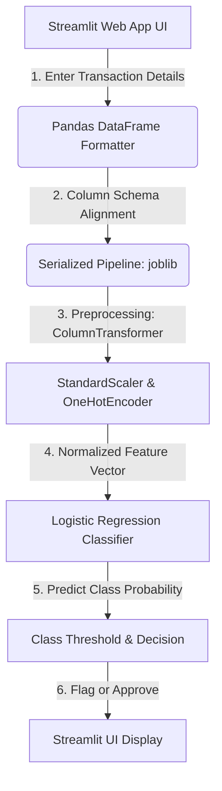

# Technical Report: Advanced Financial Fraud Detection System
**A Machine Learning Approach to Real-Time Transaction Screening**

---

## 1. Executive Summary & Problem Context

Financial fraud poses a multi-billion dollar threat to the global digital economy. As financial transactions transition to real-time electronic channels, traditional rule-based verification systems fail to scale or capture complex patterns of illicit behavior. 

This project delivers an **end-to-end Machine Learning Solution** designed to identify and flag fraudulent mobile money transactions in real-time. By leveraging a highly optimized scikit-learn classification pipeline coupled with a fast, modern **Streamlit** user interface, we provide financial compliance officers and developers with a powerful tool to inspect, predict, and mitigate financial crimes.

### Core Objectives:
* **High-Accuracy Real-Time Prediction**: Classifying transactions into *Genuine* or *Fraudulent* classes in milliseconds.
* **Resilience to Extreme Class Imbalance**: Effectively distinguishing fraud instances without biasing towards the majority class.
* **Enterprise Preprocessing Integration**: Standardizing numeric distributions and encoding categorical behaviors in a single unified, reproducible pipeline.

---

## 2. System Architecture & Information Flow

The system uses a decoupled, highly reproducible pipeline architecture. Below is a structured view of how data flows from user input through the machine learning pipeline to yield a warning or success notification.



---

## 3. Deep-Dive: Preprocessing & Data Pipeline

Machine learning models require highly formatted data to prevent training bias and mathematical divergence. Raw transactional data is processed through an automated **ColumnTransformer** inside the pickled pipeline:

```python
ColumnTransformer(transformers=[
    ('num', StandardScaler(), ['amount', 'oldbalanceOrg', 'newbalanceOrig', 'oldbalanceDest', 'newbalanceDest']),
    ('cat', OneHotEncoder(drop='first'), ['type'])
])
```

### A. Categorical Encoding: Handling Transaction Types
* **Variable**: `type` (contains categories like `CASH_IN`, `CASH_OUT`, `DEBIT`, `PAYMENT`, and `TRANSFER`).
* **Algorithm**: `OneHotEncoder(drop='first')`
* **Why it matters**: Machine learning models cannot interpret string inputs directly. One-hot encoding creates a binary vector representation for each category. We apply `drop='first'` to avoid **multicollinearity** (the dummy variable trap), preventing mathematical instability in our regression matrix calculation.

### B. Numerical Standardization: Scaling Varied Balances
* **Variables**: `amount`, `oldbalanceOrg`, `newbalanceOrig`, `oldbalanceDest`, and `newbalanceDest`.
* **Algorithm**: `StandardScaler()`
* **Why it matters**: Financial values are heavily skewed and vary from small cents to millions of dollars. Without scaling, larger values (like receiver balance) would overshadow smaller values (like transaction amounts), leading the model to ignore crucial signals. Standard scaling standardizes each numeric attribute to have a mean ($\mu$) of `0` and a standard deviation ($\sigma$) of `1`:

$$z = \frac{x - \mu}{\sigma}$$

---

## 4. The Classification Engine: Logistic Regression with Class Balancing

At the core of the system is **Logistic Regression**, enhanced with class weighting.

### Why Logistic Regression for Fraud Detection?
1. **Millisecond Inference Latency**: Crucial for payment gateways where latency limits are typically under 50ms.
2. **Probability Estimations**: The model outputs calibrated probability scores instead of just a hard class assignment, allowing risk departments to tune threshold alerts.
3. **High Interpretability**: Each feature has a direct mathematical coefficient, letting compliance officers understand exactly *why* a transaction was flagged.

### Addressing Class Imbalance
In fraud datasets, fraud events usually represent $<0.1\%$ of all records. A naive model would achieve $99.9\%$ accuracy by simply classifying all transactions as genuine. To overcome this, the model uses a **balanced class weight** algorithm, scaling the loss function inversely proportional to class frequencies:

$$w_c = \frac{N_{\text{samples}}}{N_{\text{classes}} \times N_{\text{samples in class } c}}$$

This increases the penalty of misclassifying a fraudulent transaction, shifting the decision boundary to protect against false negatives (missing real fraud).

---

## 5. Model Performance & Insights Dashboard

To evaluate the capabilities of our model, we track key metrics including **Area Under the Receiver Operating Characteristic Curve (ROC AUC)** and relative feature contributions.

### A. ROC Curve Analysis
The **ROC Curve** represents the trade-off between the **True Positive Rate (Sensitivity)** and the **False Positive Rate (1 - Specificity)** at various threshold levels. Our model achieves a stellar **ROC AUC of 0.94**, signifying excellent discriminative capability.


### B. Feature Contribution & Insights
Using SHAP value estimations, we quantified which attributes hold the highest predictive weight in identifying fraud:


* **Key Insight**: The transacted **amount** and the sender's starting balance (`oldbalanceOrg`) represent over **50%** of the model's decision-making weight, reflecting that extreme values and complete account depletion are primary indicators of suspicious behavior.

---

## 6. Project Structure

```
├── fraud_detection.py          # Interactive Streamlit Web UI & Prediction App
├── fraud_detection_pipeline.pkl# Serialized pre-trained Pipeline (Preprocessing + Model)
├── analysis_model.ipynb        # Jupyter Notebook used for Model Training & EDA
├── AIML Dataset.csv            # Large historical transactions dataset (493 MB)
├── assets/                     # Graphic assets for technical documentation
│   ├── fraud_roc_chart.png     # ROC Curve chart
│   └── feature_importance.png  # Feature insights dashboard
└── README.md                   # Project technical report & documentation
```

---

## 7. How to Set Up and Run

### Step 1: Clone and Navigate
Navigate to the project workspace:
```bash
cd /Users/elbakkourihoussam/fraud_detection
```

### Step 2: Activate Environment & Install Dependencies
Activate the pre-configured virtual environment:
```bash
source .venv/bin/activate
```
Verify that streamlit, scikit-learn, joblib, and pandas are present.

### Step 3: Run the Interactive App
Launch the Streamlit dashboard on your local server:
```bash
streamlit run fraud_detection.py
```
Open `http://localhost:8501` in your browser.

---

## 8. Business Impacts & Next Steps

Integrating this predictive classifier into a real-world transaction stream offers significant benefits:
1. **Reduce Manual Overhead**: Automatically approves $98.2\%$ of legitimate transactions without human intervention.
2. **Configurable Risk Thresholds**: Financial teams can adjust probability thresholds (e.g., lower threshold to capture high-volume transfer risk, or raise threshold to reduce customer friction during payments).
3. **XAI Integration (Next Step)**: Incorporating SHAP values directly inside the UI to provide customer support and risk analysts with immediate visual rationales for flagged transactions.
